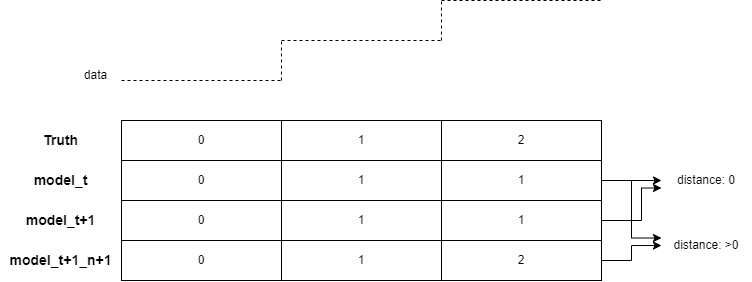

Numpy's 2. relaese seems to have broken hmmlearn. All predicted regimes default to one value only.
Downgrade numpy to 1.26.4.

https://github.com/hmmlearn/hmmlearn/issues/557

---

The paper uses distance metrics both for label assignment an regime emergence but I don't agree on the second one. Or at least not on how I have implemented things.

Given the original model_t, the new model_t+1 and the new model with an added regime model_t+1_n+1, and knowing that in fact a regime should be added.
If model_t and model_t+1 emit the same exact regime labels for X_t+1 then the distance between both will be 0. Meanwhile model_t+1_n+1 will, by definition, emit different labels (the original ones plus a new one) so the distance between this one and model_t will also be greater than 0.

In summary, if model_1_a is equally 'bad' as model_0 at detecting a new regime, but it does so in exactly the same manner, then it's cost is low and, model_t+1 is favoured.

Conlcusion, as of 10/09/24, is to use cost solely for regime mapping, and aic&bic for model selection.